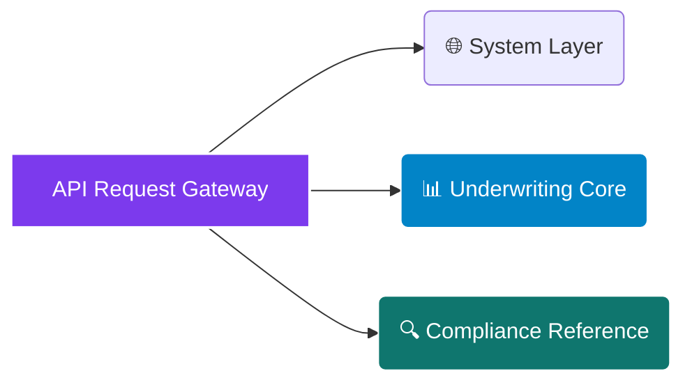

# <p align="center"></p>

<div align="center">

  <p><strong>Deterministic Multi-Jurisdictional Building Energy Compliance Engine, Automated EPC Label Classification, Stranding Risk Clock, and Euro-Zone Regulatory Asset Valuation Framework</strong></p>

</div>

<div align="center">

  <a href="https://rapidapi.com/bethelnedi/api/eu-building-energy-compliance-api"></a>
  <a href="https://elements.stoplight.io/viewer/?spec=https://raw.githubusercontent.com/bethelhash/EU-Building-Energy-Compliance-API/refs/heads/main/openapi.json"></a>
  
  
  

</div>

---

## ⚡ Executive Summary

The **EU Building Energy Compliance API** (the engineering core engine behind *EPBD EuroCompass*) is a deterministic microservice designed to automate European building energy regulation tracking, cross-border asset underwriting, and ESG risk mapping. Developed for property fund managers, acquisitions teams, real estate lenders, insurance underwriters, and certified energy consultants, this API provides clear, traceable engineering metrics across key European real estate markets.

By processing building baseline geometries and consumption inputs against **EN ISO 52000-1:2017 standards**, national transposition rules, and **EPBD 2024/1275 directives**, the calculation core builds a complete regulatory risk and valuation profile. It exposes structural non-compliance horizons, calculates mandatory solar deployment constraints, and isolates institutional "Brown Discounts" across 8 core European nations in **under 550ms**.

<blockquote align="left">

  <strong>💎 AUDIT-READY REGULATORY DUE DILIGENCE</strong><br>

  Unlike rule-of-thumb statistical estimators, this infrastructure engine exposes an unshakeable, fully citation-backed audit trail. From primary energy factor conversions to Scope 3 ICE Database v3.0 embodied carbon calculations and SFDR PAI 18/19 reporting matrices, every result maps directly to published legislative frameworks, enabling direct integration into professional corporate workflows.

</blockquote>

---

## 🏛️ Enterprise Core Capabilities (Seven-In-One Framework)

<table width="100%">
  <tr>
    <td width="50%" valign="top">
      <h3>📋 1. Cross-Border EPC Harmonization</h3>
      <ul>
        <li><strong>Multi-Jurisdictional Classification:</strong> Dynamically calculates local Energy Performance Certificate (EPC) ratings from Germany's GEG to France's DPE and Netherlands' NTA 8800.</li>
        <li><strong>Traceable Threshold Mapping:</strong> Resolves primary energy use intensities ($\text{kWh/m}^2/\text{year}$) against statutory bands and national baseline methodologies.</li>
      </ul>
      <h3>⚠️ 2. EPBD 2024 &amp; National MEPS Screening</h3>
      <ul>
        <li><strong>Article 7 Enforcement Filters:</strong> Identifies at-risk assets failing Minimum Energy Performance Standards (MEPS) timelines.</li>
        <li><strong>Gold-Plating Compliance Tracks:</strong> Models localized hyper-strict mandates such as the Dutch *Kantoreneis* (EPC C for offices) and France's *Décret Tertiaire*.</li>
      </ul>
      <h3>⏳ 3. Stranding Risk Clock Analytics</h3>
      <ul>
        <li><strong>Temporal Non-Lettability Horizons:</strong> Pinpoints the precise calendar year an asset becomes legally un-lettable or exposed to municipal fines.</li>
        <li><strong>Penalty Exposure Tracks:</strong> Computes cumulative liability exposure up to 2030 based on BPIE benchmarked enforcement models.</li>
      </ul>
      <h3>🏗️ 4. Retrofit Renovation Sandbox</h3>
      <ul>
        <li><strong>Physics-Based Intervention Toggles:</strong> Models envelope insulation, MVHR systems, triple glazing, and BMS controls simultaneously.</li>
        <li><strong>EN 14825 Heat Pump Modeling:</strong> Accurately removes fossil fuel loads and scales electrical demands using Seasonal Coefficient of Performance ($\text{SCOP} = 3.5$) parameters.</li>
      </ul>
    </td>
    <td width="50%" valign="top">
      <h3>☀️ 5. Solar Obligation Screening (Art. 9)</h3>
      <ul>
        <li><strong>Mandatory Deployment Checks:</strong> Screens roof structures against EPBD Annex III mandates for new or heavily renovated properties.</li>
        <li><strong>PVGIS Yield Interrogation:</strong> Ingests JRC PVGIS-SARAH2 satellite data to return localized LCOE profiles and internal self-consumption splits.</li>
      </ul>
      <h3>🏢 6. Enterprise Portfolio Batch Processing</h3>
      <ul>
        <li><strong>100-Asset Concurrent Calculations:</strong> Evaluates complete real estate funds in a single execution thread, automatically ranking properties by penalty exposure.</li>
        <li><strong>Aggregated CAPEX Optimization:</strong> Consolidates portfolio remediation expenses alongside eligible regional grant offsets (e.g., BEG, MaPrimeRénov').</li>
        <li><strong>SFDR PAI Disclosure Automation:</strong> Compiles standardized Principal Adverse Impact (PAI 18 &amp; 19) metric breakdowns for ESG regulatory filings.</li>
      </ul>
      <h3>📉 7. Institutional Brown Discount Valuation</h3>
      <ul>
        <li><strong>Liability Stack Underwriting:</strong> Computes exact corrections based on net retrofit CAPEX, cumulative penalties, and cap-rate expansions.</li>
        <li><strong>Corporate Bid Price Adjustment:</strong> Automatically outputs audited valuation targets using the formula:
        $$\text{Bid Price} = \text{Asking Price} - \text{Net CAPEX} - \text{Penalties} - \text{Brown Discount}$$</li>
      </ul>
    </td>
  </tr>
</table>

---

## 🗺️ Market Architecture Hub

### 🌍 Supported Jurisdictions & Technical Baseline
The engine handles local grid properties, building regulations, and core grant programs across Europe:
`United Kingdom (MEES)` &middot; `Germany (GEG 2024)` &middot; `France (Décret Tertiaire)` &middot; `Netherlands (NTA 8800)` &middot; `Italy (APE)` &middot; `Spain (CEE)` &middot; `Poland (KPO)` &middot; `Sweden (Klimatklivet)`

### 🏢 Covered Real Estate Asset Classes
Compliance evaluations calibrate energy intensity benchmarks across standard commercial and residential categories:
`Office` &middot; `Retail` &middot; `Hotel` &middot; `Residential (Multi-Family)` &middot; `Industrial` &middot; `Hospital` &middot; `Education`

---

## 📂 API Core Endpoint Directory



---

### 🌐 System Layer

* `GET /health` — Verifies engine operational stability, returning active compilation versions and country matrix loads.
* `GET /pricing` — Returns active platform tier restrictions, execution rate limits, and product feature inclusions.

### 📊 Underwriting Core

* `POST /analyse/quick` — Fast top-of-funnel screening node. Converts gross floor space and monthly utility outlays into an estimated EPC letter grade and baseline carbon footprint using current Eurostat energy costs. *(Free Tier)*
* `POST /analyse/full` — Core compliance engine. Processes multidimensional delivered fuel arrays (electricity vs. gas) to evaluate primary EUIs, solar obligations, and regional cash grant eligibility. *(Pro Tier)*
* `POST /analyse/stranding-risk` — Asset protection node. Maps building parameters against regional MEPS timelines to compute stranding horizons, value-at-risk records, and multi-year cumulative municipal penalty exposure. *(Pro Tier)*
* `POST /analyse/renovation-sandbox` — Interactive retrofit node. Simulates custom combinations of passive insulation and active heat pump arrays to project immediate EPC label movements, simple payback ranges, and asset value adjustments. *(Pro Tier)*
* `POST /analyse/solar-screening` — Solar feasibility node. Models roof potential against EPBD Article 9 rules to calculate required generation, localized PVGIS outputs, and LCOE structures. *(Pro Tier)*
* `POST /analyse/brown-discount` — Transaction underwriting node. Ingests purchase asking baselines, projected CAPEX, and local cap rate properties to structure a defensible bid pricing adjustment. *(Pro Tier)*
* `POST /analyse/renovation-passport` — Automated Article 12 compliance node. Generates an official multi-stage phased building renovation roadmap, mapped directly to ZEB (Zero-Emission Buildings) 2050 benchmarks. *(Pro Tier)*
* `POST /analyse/refinancing-risk` — Commercial credit protection node. Evaluates loan maturity schedules against stranding timelines to flag capital exposure and potential interest margin step-ups. *(Pro Tier)*
* `POST /analyse/sfdr-pai` — ESG disclosure tool. Generates aggregated portfolio floor area statistics for SFDR PAI 18 and PAI 19 regulatory frameworks. *(Pro Tier)*
* `POST /analyse/lender-pack` — Credit committee risk pack engine. Generates credit risk summaries, post-remediation LTV shifts, and loan covenant conditions for real estate lenders. *(Pro Tier)*
* `POST /analyse/embodied-carbon` — Life-cycle Scope 3 assessment node. Maps renovation volumes against ICE Database v3.0 factors to weigh initial embodied carbon footprints against long-term operational savings. *(Pro Tier)*
* `POST /analyse/batch-portfolio` — High-capacity batch node. Processes up to 100 assets simultaneously, ranking individual properties by risk exposure. *(Pro Tier)*

### 🔍 Compliance Reference Hub

* `GET /reference/countries` — Streams foundational parameters including national Primary Energy Factors (PEFs) and grid carbon coefficients.
* `GET /reference/building-types` — Details typical EU baseline energy intensities sourced from the JRC Building Stock Observatory.
* `GET /reference/epc-thresholds` — Exposes exact primary energy intensity boundary matrices for all supported states.
* `GET /reference/renovation-measures` — Pulls the active engineering measure index containing unit cost assumptions and EUI reduction coefficients.
* `GET /reference/meps-timelines` — Streams regulatory enforcement calendars and landmark dates across all covered nations.
* `GET /reference/methodology` — Exposes full underlying mathematical logic loops, physical assumptions, and programmatic engineering references.

---

## 📈 Engineering Methodology & Verification Matrix

The computing core ensures complete corporate accountability by mapping every processing stage to institutional standards and legislative targets:

| Analytical Pipeline Stage | Governed Standards & Regulatory Frameworks | Primary Empirical Data Source / Citation Reference |
| --- | --- | --- |
| **Primary Energy Balances** | EN ISO 52000-1:2017 Framework | European Committee for Standardization (CEN) Technical Protocols |
| **EPC Boundary Systems** | EN ISO 52003-1:2017 Grading | National Building Energy Transpositions (GEG, DPE, NTA 8800, APE) |
| **MEPS Enforcement Paths** | Directive (EU) 2024/1275 Article 7 | European Parliament EPBD 2024 Legal Statutory Requirements |
| **Heat Pump Performance** | EN 14825:2022 Thermal Calculations | Seasonal Coefficient of Performance (SCOP) Curve Formulations |
| **Renovation Economics** | Archetype Unit Costing Models | JRC TABULA / EPISCOPE Building Typology Database (2023 Update) |
| **Solar Generation Yield** | PVGIS Estimation Algorithms | Joint Research Centre (JRC) PVGIS-SARAH2 Irradiance Matrix |
| **Brown Discount Scaling** | Cap-Rate Valuation Regressions | JLL Green Premium & CBRE European ESG Property Pricing Indexes |
| **Embodied Carbon Mass** | Scope 3 Material Intensities | Sustainable Energy Research Team (SERT) Inventory of Carbon & Clean Energy (ICE v3.0) |
| **Refinancing Risk Paths** | Credit Committee Exposure Gauges | European Central Bank (ECB) Climate-Related Risk Underwriting Guide |

---

## 🚀 Quickstart Integration Example (Python)

To run a professional refinancing risk asset evaluation for a commercial real estate property, utilize the integration blueprint below:

```python
import json
import requests

# Core Routing Configuration via RapidAPI Gateway
GATEWAY_URL = "[https://eu-building-energy-compliance.p.rapidapi.com/analyse/refinancing-risk](https://eu-building-energy-compliance.p.rapidapi.com/analyse/refinancing-risk)"

payload = {
    "country": "uk",
    "epc_label": "D",
    "primary_eui_kwh_m2": 198,
    "floor_area_m2": 5100,
    "stranding_year": 2027,
    "loan_maturity_year": 2028,
    "loan_outstanding_eur": 12000000,
    "annual_noi_eur": 460000
}

headers = {
    "Content-Type": "application/json",
    "X-API-Key": "YOUR_SECURE_MARKETPLACE_TOKEN",
    "X-RapidAPI-Host": "eu-building-energy-compliance.p.rapidapi.com"
}

response = requests.post(GATEWAY_URL, json=payload, headers=headers)
print(json.dumps(response.json(), indent=2))

```

---

## 💎 Production Access Tiers

| Tier Classification | Monthly Access Fees | Active Rate Latency Caps | Inclusive Data Volume Quota | Programmatic Endpoint Access | Support Service Level |
| --- | --- | --- | --- | --- | --- |
| **Free Sandbox Tier** | $0 / Month | 5 Requests / Minute | 10 Scans / Month | `/analyse/quick` + Reference Hub | Open Community Forum |
| **Pro Enterprise** | $49.00 / Month | 1,000 Requests / Hour | Unlimited Volume Quota | All Endpoints (Includes 100 Batch) | Standard Service SLA |
| **Ultra Institutional** | $149.00 / Month | 5,000 Requests / Month | Unlimited Volume Quota | Full Access + Full White-Label Rights | Dedicated Operations SLA |

* **Platform Tool Access & Integrations:** Pro and Ultra tiers unlock direct key validations on the *EPBD EuroCompass Web Application Framework*. Subscribing to the platform lets you input your API credentials directly into web views to download complete client-ready Building Renovation Passports and custom PDF credit risk sheets.
* **White-Label Integration Deployment:** Ultra tier subscribers gain structural rights to remove native branding metrics and frame the interactive design framework directly on corporate engineering domains, property marketplaces, or brokerage platforms (subject to a 1-day deployment domain validation).

---

## 🔒 Proprietary License & Terms

### Intellectual Property Protection

**Copyright © 2026 Axiom Infrastructure Intelligence LLP. All rights reserved.**

The EU Building Energy Compliance API, its internal multi-jurisdictional primary energy factor conversion databases, time-based stranding matrix scripts, automated brown discount financial assessment logic, and European building stock archetype profiles are the exclusive proprietary intellectual property of Axiom Infrastructure Intelligence LLP. No part of this technical architecture layout, backend parsing logic, or endpoints may be duplicated, reverse-engineered, white-labeled, or redistributed without an executed Master Services Agreement (MSA) and express written licensing permission from the corporate rights holder.

### Technical Due Diligence Disclaimer

All compliance metrics, stranding calculations, penalty projections, and investment pricing outputs generated by this API are designed as high-fidelity pre-assessment screening and due diligence utilities. This microservice does not issue official building certifications or legally binding energy performance grades. Official environmental declarations and local legislative compliance filings require on-site engineering evaluations by a licensed, accredited regional property energy inspector.

```

```
